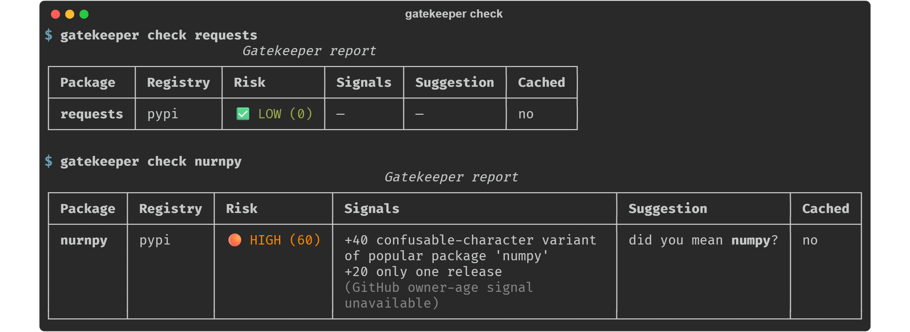
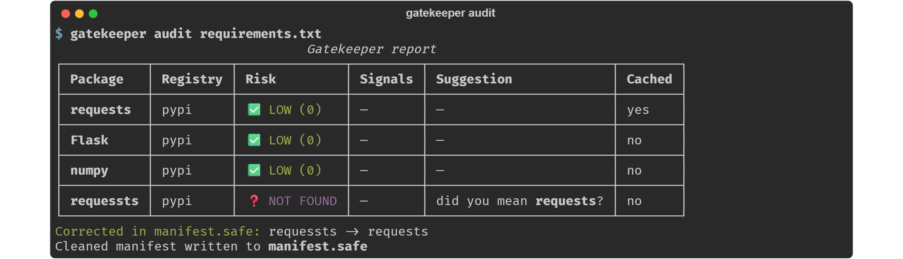

# Gatekeeper

[](https://github.com/abidedavana/Gatekeeper/actions/workflows/ci.yml)
[](https://github.com/abidedavana/Gatekeeper/releases)
[](pyproject.toml)
[](LICENSE)

Validate package names against PyPI and npm **before** you install them.

Gatekeeper is a supply-chain hygiene tool (in the spirit of `pip-audit` or npm's
advisory tooling): it looks up every package in your manifest on the public
registry, flags names that look like typosquats of popular packages, highlights
brand-new or single-release packages, and writes a cleaned `manifest.safe` with
unambiguous typos corrected. It never installs, downloads, or executes anything —
its only network traffic is read-only calls to the PyPI JSON API, the npm
registry API, and (optionally) the GitHub users API.



*(Live, unedited run: `nurnpy` really exists on PyPI — Gatekeeper flags it HIGH.)*

## Installation

```bash
# pinned to a release tag (recommended)
pip install git+https://github.com/abidedavana/Gatekeeper.git@v1.0.0

# latest from main
pip install git+https://github.com/abidedavana/Gatekeeper.git

# from a checkout
pip install .

# as a container
docker run --rm -v "$PWD:/work" ghcr.io/abidedavana/gatekeeper audit /work/requirements.txt
```

Wheels and sdists are attached to every [GitHub release](https://github.com/abidedavana/Gatekeeper/releases).

> **Note:** not yet on PyPI. The existing `gatekeeper-cli` project on PyPI is an
> **unrelated package** — fittingly, exactly the kind of name collision this tool
> warns about — so do not `pip install gatekeeper-cli`. PyPI publication will
> happen under a different distribution name.

Requires Python 3.10+.

## Usage

```bash
gatekeeper check <package> [--type pip|npm] [--json]   # one package (default: pip)
gatekeeper audit <manifest> [--json] [--strict] [--output PATH]
gatekeeper cache status
gatekeeper cache clear
```



* `audit` auto-detects the manifest type from the filename
  (`requirements*.txt` → pip, `package.json` → npm); use `--type` to override.
* `audit` writes a cleaned manifest to `<manifest dir>/manifest.safe`
  (override with `--output`). Only **unambiguous typos** are corrected there:
  names that do **not exist** on the registry but are within 2 edits of a
  popular package. A suspicious name that *does* exist (a live typosquat
  candidate) is flagged in the report but never silently renamed.
* Exit code is `0` when everything is LOW/MEDIUM, `1` when any package is
  HIGH/CRITICAL or not found. With `--strict`, registry lookup errors also
  exit `1` (by default they are reported but non-fatal, so a registry outage
  doesn't hard-fail CI).

Environment variables:

| Variable | Effect |
|---|---|
| `GITHUB_TOKEN` | Used for the optional GitHub owner-age lookup (higher rate limits). |
| `GATEKEEPER_NO_GITHUB=1` | Disable the GitHub lookup entirely. |
| `GATEKEEPER_NO_PREFETCH=1` | Disable background cache prefetching. |

### CI usage

```yaml
- run: pip install git+https://github.com/abidedavana/Gatekeeper.git@v1.0.0
- run: gatekeeper audit requirements.txt --json > gatekeeper-report.json
```

## Scoring

Each signal contributes a fixed number of points; points are summed and capped
at 100. At most **one** similarity signal applies per package (substitution
collision takes precedence, then the smallest edit distance). Packages whose
name is exactly one of the bundled popular packages never receive a similarity
signal.

| Signal id | Points | Trigger |
|---|---|---|
| `SUBSTITUTION_PATTERN` | 40 | Name equals a popular package after folding confusable characters: `rn`↔`m`, `0`↔`o`, `l`↔`1`. (`r`↔`rn` is a single-character insertion, already caught as edit distance 1.) |
| `TYPOSQUAT_DISTANCE_1` | 40 | Levenshtein distance 1 from a popular package |
| `TYPOSQUAT_DISTANCE_2` | 25 | Levenshtein distance 2 from a popular package |
| `NEW_PACKAGE` | 30 | First release less than 7 days ago |
| `SINGLE_RELEASE` | 20 | Exactly one release |
| `FEW_RELEASES` | 10 | 2–4 releases |
| `YOUNG_GITHUB_OWNER` | 15 | Linked GitHub repo owner account is < 90 days old (best-effort; see below) |

Risk bands (inclusive on both ends):

| Level | Score |
|---|---|
| LOW | 0–39 |
| MEDIUM | 40–59 |
| HIGH | 60–79 |
| CRITICAL | 80–100 |

Packages that are **not found** or whose lookup **errored** get no score
(`score: null`); they are reported with their own status, and not-found names
still receive a typo suggestion when one exists.

The "popular packages" reference list is a bundled static snapshot of the top
~150 PyPI and ~150 npm packages
([`src/gatekeeper/data/top_packages.json`](src/gatekeeper/data/top_packages.json)).
It is shipped as data, not fetched live, because neither registry exposes a
public "top packages" endpoint.

### Exactly which registry fields are used

Every scored signal maps to a concrete key in the public API responses:

| Signal | Source | Exact JSON key |
|---|---|---|
| First-release age | PyPI `GET /pypi/<name>/json` | min of `releases.<version>[].upload_time_iso_8601` |
| First-release age | npm `GET registry.npmjs.org/<name>` | `time.created` |
| Release count | PyPI | number of keys in `releases` |
| Release count | npm | number of keys in `versions` |
| Repo link | PyPI | `info.project_urls` values / `info.home_page` |
| Repo link | npm | `repository.url` (or `repository` as a plain string) |
| Owner account age | GitHub `GET /users/<owner>` | `created_at` |
| Name similarity | local | bundled static list (no API) |

**Deliberately not implemented:** "maintainer account creation date" from
PyPI/npm — neither registry's public API exposes that field. The only
account-age signal is the GitHub fallback above, and when a package links no
GitHub repository the report explicitly marks the signal as `unavailable`
rather than guessing.

### Levenshtein implementation

Classic dynamic programming with two rolling rows: `O(n·m)` time,
`O(min(n, m))` space, with an early-abandon cutoff at distance 2 for the
scanning path. No recursion, no exponential blow-up (there is a regression
test that runs it on 500-character inputs).

## Caching

Metadata is cached in SQLite at `~/.gatekeeper/cache.db`:

* **WAL journal mode**, plus retry-with-exponential-backoff (and SQLite
  `busy_timeout`) on `SQLITE_BUSY`, so several gatekeeper processes can share
  the file safely.
* Normal entries expire after **24 hours** (checked lazily on read).
* The **top 50** packages (first 25 of each bundled list) are **pinned**: they
  never expire and are never evicted.
* **Eviction** is least-recently-used over non-pinned rows only (ordered by
  tracked `last_access`, then `access_count`) and triggers once the non-pinned
  count exceeds **500**. The whole eviction pass — insert, count, select
  victims, delete — runs inside a single `BEGIN IMMEDIATE` transaction.
  `BEGIN IMMEDIATE` takes SQLite's one write lock up front, so eviction is
  single-writer by construction: two processes can never interleave the same
  pass; the second blocks (or backs off and retries) until the first commits,
  then re-counts against the committed state.
* Successful and not-found lookups are cached; transient errors never are.

### Background prefetch

Checking `torch` also warms the cache for `torchvision` and `torchaudio`, via
a small static co-occurrence map (~15–20 clusters such as the torch, boto3,
requests, react and aws-sdk families —
[`src/gatekeeper/data/cooccurrence.json`](src/gatekeeper/data/cooccurrence.json)).
Prefetch is strictly fire-and-forget:

* Tasks are scheduled without being awaited, and the report is **rendered
  before** prefetch completion is ever waited on — prefetch can only run
  concurrently with output, never delay it.
* After output, stragglers get a bounded grace period (2 s) and are then
  cancelled, so process exit is bounded too.
* Every prefetch task catches and logs its own exceptions; a prefetch failure
  can never surface in the main result.

## Failure behavior

Network problems degrade gracefully instead of crashing:

* Explicit request timeout (10 s total per request).
* Retry with exponential backoff (3 attempts) on HTTP 429 and 5xx —
  `Retry-After` is honored when present — and on timeouts/connection errors.
* HTTP 404 → status `not_found` (definitive, not retried).
* Other 4xx, exhausted retries, and malformed JSON → status `error` with a
  human-readable message in the report; by default errors do not fail the run
  (see `--strict`).

## JSON output schema (`--json`)

Stable, versioned via `schema_version` (currently `1`):

```json
{
  "schema_version": 1,
  "tool": { "name": "gatekeeper", "version": "1.0.0" },
  "generated_at": "2026-07-05T12:00:00+00:00",
  "results": [
    {
      "name": "requessts",
      "registry": "pypi",
      "status": "ok | not_found | error",
      "error": null,
      "score": 40,
      "level": "MEDIUM",
      "signals": [
        { "id": "TYPOSQUAT_DISTANCE_1", "points": 40,
          "detail": "1 edit away from popular package 'requests'" }
      ],
      "suggestion": "requests",
      "cached": false,
      "metadata": {
        "first_release": "2020-01-15T00:00:00+00:00",
        "release_count": 7,
        "repo_url": "https://github.com/owner/repo",
        "github_owner": "owner",
        "github_owner_created": "2016-08-13T05:07:47+00:00",
        "github_signal": "available | unavailable"
      }
    }
  ],
  "summary": {
    "total": 1, "low": 0, "medium": 1, "high": 0, "critical": 0,
    "not_found": 0, "errors": 0
  }
}
```

Notes for parsers: `score`/`level` are `null` whenever `status != "ok"`;
`suggestion` is `null` when no popular package is within 2 edits; timestamps
are ISO 8601 UTC.

## Docker

Prebuilt images are published to GHCR on every release:

```bash
docker pull ghcr.io/abidedavana/gatekeeper:latest
```

Or build locally:

```bash
docker build -t gatekeeper .
docker run --rm -v "$PWD:/work" gatekeeper audit /work/requirements.txt
# persist the cache between runs:
docker run --rm -v gatekeeper-cache:/home/app/.gatekeeper -v "$PWD:/work" \
    gatekeeper audit /work/requirements.txt
```

## Docs & media

* Overview slide deck: [docs/Gatekeeper.pptx](docs/Gatekeeper.pptx)
* Terminal screenshots (SVG + PNG, generated from real runs): [docs/screenshots/](docs/screenshots/)

## Development

```bash
pip install -e ".[dev]"
pytest            # 108 tests, all HTTP mocked — no live network calls
ruff check src tests
```

CI ([.github/workflows/ci.yml](.github/workflows/ci.yml)) runs ruff plus the
test matrix (Python 3.10–3.12) on every pull request.

## Limitations

* The popularity list is a static snapshot; genuinely popular new packages
  won't be protected until the list is refreshed.
* Scores are heuristics for triage, not verdicts. A HIGH score means "look
  before you install", not "malware".
* npm scoped packages (`@scope/name`) are supported for lookups; the
  similarity check treats the full scoped name as the comparison unit.
